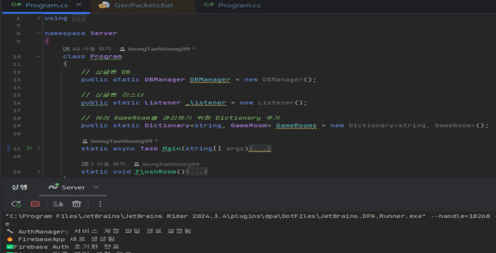
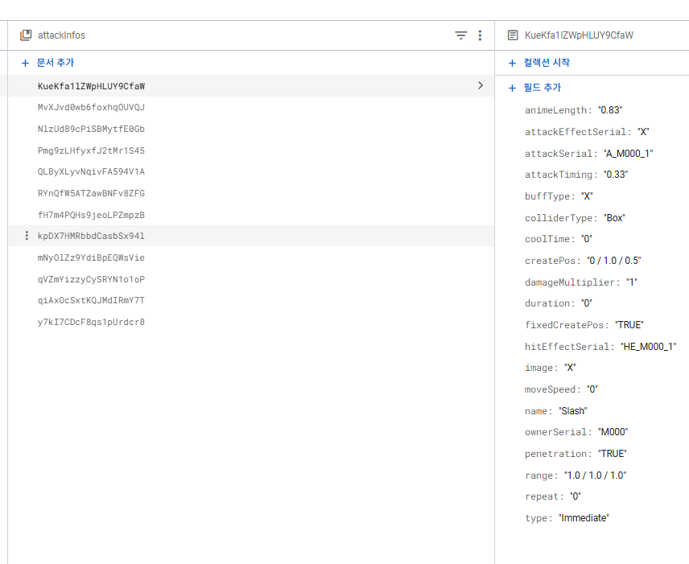
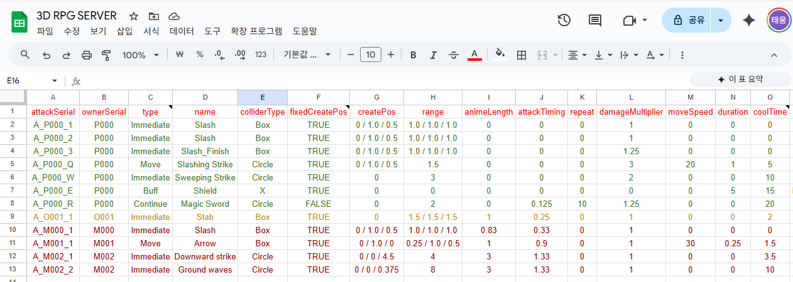
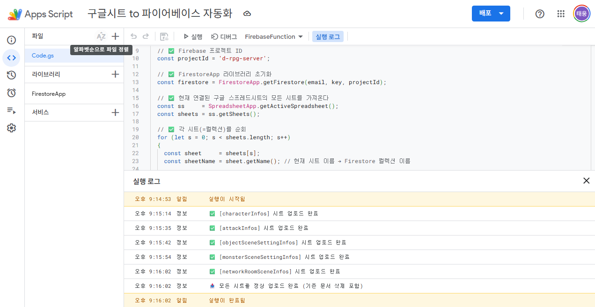

# 모험가 키우기 - 서버 리포지토리

## 📑 목차
- [📋 개요](#-개요)
- [🎬 관련 사진](#-관련-사진)
- [🔗 관련 링크](#-관련-링크)
- [✨ 주요 기능](#-주요-기능)
- [🔨 개발 이력](#-개발-이력)
- [📂 프로젝트 구조](#-프로젝트-구조)
- [🛠 기술 스택](#-기술-스택)
- [🏗 아키텍처](#-아키텍처)
- [📊 성능 특성](#-성능-특성)

## 📖 개요

| 항목 | 내용 |
|---|---|
| **기간** | 2025.05 ~ 2025.08 |
| **인원** | 1인 개발 |
| **역할** | 클라이언트, 서버, DB |
| **도구** | UNITY, C#, TCP SOCKET, FIREBASE |
| **타겟 기기** | PC |
| **참고 강의** | [C#과 유니티로 만드는 MMORPG 게임 개발 시리즈 Part4: 게임 서버](https://www.inflearn.com/course/%EC%9C%A0%EB%8B%88%ED%8B%B0-mmorpg-%EA%B0%9C%EB%B0%9C-part4) |

Unity 클라이언트와 통신하는 **C# 데디케이트 서버**입니다.

비동기 TCP 소켓 통신, XML 기반 패킷 자동 생성, Firebase 연동을 통해 실시간 멀티플레이어 3D RPG 게임을 지원합니다.

### 개발 배경
참고 강의를 통해 **서버 프로그래밍 이론**과 **기본 프레임워크**(네트워크 코어, 패킷 자동 생성 시스템)를 학습했습니다. 

이후 Unity 클라이언트와 연동하면서 게임 컨텐츠가 확장됨에 따라, Session 구조 재설계, DB 시스템 구축, 게임 Manager 개발 등 **서버 기능을 직접 확장 및 추가**했습니다.


## 🎬 관련 사진

<table>
  <tr>
    <td align="center">
      
      <br/>
      <b>C# 데디케이트 서버</b>
    </td>
    <td align="center">
      
      <br/>
      <b>FIREBASE DB</b>
    </td>
  </tr>
  <tr>
    <td align="center">
      
      <br/>
      <b>구글 시트</b>
    </td>
    <td align="center">
      
      <br/>
      <b>구글 Apps Script</b>
    </td>
  </tr>
</table>

## 🔗 관련 링크

| 항목            | 링크 |
|---------------|---|
| **클라 GitHub** | [바로가기](https://github.com/JeongTaeWoong99/Adventurer_Raising/tree/main) |

## ✨ 주요 기능

### 🔄 실시간 멀티플레이어
- **비동기 TCP 소켓 통신** : `SocketAsyncEventArgs` 기반 고성능 I/O
- **40FPS 서버 틱** : 25ms 간격으로 게임 상태 동기화
- **GameRoom 기반 씬 관리** : 씬별 독립적인 게임 세션 운영
- **플레이어/몬스터/오브젝트 동기화** : 실시간 위치, 애니메이션, 상태 브로드캐스트

### 📦 자동 패킷 생성 시스템
- **XML 기반 패킷 정의** : PDL.xml에서 선언적 패킷 정의
- **코드 자동 생성** : PacketGenerator가 C# 클래스 자동 생성
  - 패킷 클래스 (직렬화/역직렬화 포함)
  - ClientPacketManager / ServerPacketManager
  - 패킷 ID 열거형 및 핸들러 등록
- **휴먼 에러 제거** : 수작업 패킷 코딩 대비 실수 방지

### 🎯 게임 시스템

#### 전투 시스템
- **다양한 공격 타입** :
  - `immediate` : 즉시 데미지 적용
  - `move` : 투사체 이동 후 충돌
  - `continue` : 지속 범위 데미지
  - `buff` : 무적, 데미지 증가, 이동속도 버프
- **충돌 감지** : Circle vs Circle, OBB(Oriented Bounding Box) vs Circle
- **히트 판정** : 넉백, 피격 애니메이션, 데미지 계산
- **경험치 획득** : 몬스터 처치 시 경험치 드랍 및 레벨업

#### 몬스터 AI
- **상태 기반 행동** : Idle → 플레이어 감지 → Run(추적) → Attack
- **자동 전투** : 공격 범위 내 진입 시 자동 공격 (쿨다운 적용)
- **자연스러운 이동** : 랜덤 오프셋 적용으로 직선 이동 방지
- **서버 권위** : 모든 AI 로직 서버에서 처리

#### 스폰 관리
- **자동 스폰** : 씬별 몬스터/오브젝트 초기 배치
- **리스폰 시스템** :
  - 2단계 리스폰 (5초 Leave 애니메이션 + 5초 대기 = 10초)
  - mmNumber 기반 O(1) 위치 조회
- **씬 데이터 기반** : Firebase에서 스폰 위치, 개수, 반경 로드

#### 스케줄링 시스템
- **애니메이션 타이밍** : 공격, 피격, 이동 애니메이션 자동 전환
- **자동 공격** : 오브젝트(트랩) 반복 공격 스케줄링
- **리스폰 예약** : 사망 후 정확한 시간에 재생성

#### 실시간 채팅
- 게임 내 텍스트 채팅 시스템

### 🔐 데이터베이스 및 인증
- **Firebase Authentication** : 이메일 기반 로그인/회원가입
- **Firebase Realtime Database** : 플레이어 세션 데이터 (위치, HP, 레벨, 경험치)
- **Cloud Firestore** : 게임 설정 데이터 (캐릭터 스탯, 공격 정보, 스폰 설정)
- **JSON 로컬 캐싱** : 게임 데이터 딕셔너리 기반 빠른 조회

### 🎮 플레이어 시스템
- **레벨업 시스템** : 경험치 누적 → 레벨업 → 스탯 재계산 (HP, 데미지, 이동속도)
- **씬 전환** : 포털/스폰 포인트 기반 씬 이동
- **사망 처리** : Village 씬으로 리스폰, HP 전체 회복
- **데이터 영속성** : 접속 종료 시 Realtime DB에 자동 저장

## 🔨 개발 이력

이 프로젝트는 강의를 통해 기본 프레임워크를 학습한 후, Unity 클라이언트 컨텐츠 확장에 맞춰 서버 기능을 점진적으로 확장했습니다.

### 📚 강의 기반 구현 (학습)

참고 강의를 통해 다음 핵심 기술을 학습하고 구현했습니다:

#### ServerCore (네트워크 코어 라이브러리)
- **비동기 TCP 소켓 통신** : `SocketAsyncEventArgs` 기반 고성능 I/O
- **Listener, Session, PacketSession** : 클라이언트 연결 관리 및 패킷 처리 기반 구조
- **RecvBuffer / SendBuffer** : 링 버퍼 기반 패킷 송수신
- **JobQueue** : 단일 스레드 작업 큐로 멀티스레드 동기화
- **PriorityQueue** : 우선순위 기반 작업 관리

#### PacketGenerator (패킷 자동 생성 시스템)
- **XML 기반 패킷 정의** : PDL.xml에서 선언적 패킷 구조 정의
- **코드 자동 생성** : 패킷 클래스, 직렬화/역직렬화, PacketManager 자동 생성
- **클라이언트-서버 동기화** : 단일 XML에서 양쪽 코드 생성으로 불일치 방지

#### 기본 서버 구조
- **GameRoom** : JobQueue 기반 게임 룸 관리
- **기본 패킷 구조** : Enter, Move, Leave (3개 패킷)
- **PacketSession → ClientSession** : 2단계 세션 구조

---

### 🚀 확장 및 추가 구현 (직접 개발)

Unity 클라이언트 컨텐츠 확장에 따라 다음 기능들을 직접 설계하고 구현했습니다:

#### Session 구조 재설계
강의에서는 `PacketSession → ClientSession` 2단계 구조였으나, 몬스터/오브젝트 추가로 **공통 엔티티 계층 필요**

**기존 구조 (강의)**:
```
Session → PacketSession → ClientSession
```

**확장 구조 (직접 설계)**:
```
Session → PacketSession → CommonSession (공통 엔티티 속성)
                              ├── ClientSession  (플레이어)
                              ├── MonsterSession (몬스터 AI)
                              └── ObjectSession  (트랩/오브젝트)
```

**추가 사항**:
- `CommonSession` : 공통 속성 통합 (PosX/Y/Z, HP, AnimationId, Damage 등)
- `MonsterSession` : 몬스터 AI 로직, 플레이어 추적, 자동 공격
- `ObjectSession` : 트랩/오브젝트 자동 공격 스케줄링

**Server/Session/CommonSession.cs:7-50** - 공통 엔티티 베이스 클래스

---

#### 패킷 시스템 확장
강의에서는 3개 패킷만 다뤘으나, 게임 컨텐츠 확장에 따라 **16개 패킷으로 확장**

**기존 (강의)**: Enter, Move, Leave (3개)

**확장 (직접 추가)**:
- **인증/계정** : C_RequestMakeId, S_MakeIdResult, C_RequestLogin, S_LoginResult
- **엔티티 관리** : S_BroadcastEntityList, S_BroadcastEntityEnter, S_BroadcastEntityLeave, S_BroadcastEntityInfoChange, C_SceneChange
- **이동/회전** : C_EntityMove, S_BroadcastEntityMove, C_EntityRotation, S_BroadcastEntityRotation
- **전투** : C_EntityAnimation, S_BroadcastEntityAnimation, C_EntityDash, S_BroadcastEntityDash, C_EntityAttackAnimation, S_BroadcastEntityAttackAnimation, C_EntityAttack, S_BroadcastEntityAttackEffectCreate, S_BroadcastEntityAttackResult
- **채팅** : C_Chatting, S_BroadcastChatting

**PacketGenerator/PDL.xml:1-249** - 확장된 패킷 정의

---

#### DB 시스템 (Firebase 연동)
강의에서는 DB를 다루지 않았으나, 게임 데이터 영속성을 위해 **Firebase 연동 시스템 구축**

**추가 구성**:
- **DBManager** : 통합 DB 관리자 (Auth, RealTime, Firestore 통합)
- **AuthManager** : Firebase Authentication 연동 (회원가입, 로그인)
- **RealTimeManager** : Firebase Realtime Database 연동 (플레이어 세션 데이터 저장/로드)
- **FirestoreManager** : Cloud Firestore 연동 (게임 설정 데이터, Dictionary 캐싱)

**데이터 자동화**:
- Google Spreadsheet → Apps Script → Firebase → 서버/클라이언트 자동 다운로드
- 게임 데이터 수정 시 단일 시트 수정으로 클라이언트/서버 동시 최신화

**Server/DB/** - Firebase 연동 모듈 (전체 신규 추가)

---

#### 게임 시스템 Manager (신규 개발)
게임 컨텐츠 구현을 위해 **핵심 Manager 3개 직접 설계 및 구현**

**AttackManager** (전투 시스템)
- 다양한 공격 타입 (immediate, move, continue, buff)
- 충돌 감지 (Circle vs Circle, OBB vs Circle)
- 데미지 계산, 넉백, 히트 처리

**SpawnManager** (스폰 관리)
- 씬별 몬스터/오브젝트 초기 스폰
- 2단계 리스폰 시스템 (Leave 애니메이션 + 대기)
- mmNumber 기반 O(1) 스폰 위치 조회

**ScheduleManager** (시간 관리)
- 단일 타이머(100ms)로 모든 시간 기반 작업 관리
- 애니메이션 자동 전환 (Hit → Idle, Attack → Idle)
- 몬스터 AI 플레이어 탐지 (100ms마다)
- 리스폰 예약, 트랩 자동 공격

**Server/AttackManager.cs, SpawnManager.cs, ScheduleManager.cs** - 게임 시스템 Manager (전체 신규 추가)

---

#### 게임 컨텐츠
- **몬스터 AI** : Idle → 플레이어 감지 → 추적 → 공격 (상태 기반 행동)
- **전투 시스템** : 4가지 공격 타입, 충돌 감지, 데미지 계산
- **레벨업 시스템** : 경험치 획득 → 레벨업 → 스탯 재계산
- **씬 전환 시스템** : 포털 기반 씬 이동, 스폰 위치 관리
- **실시간 채팅** : 게임 내 텍스트 채팅

---

### 📊 개발 범위 요약

| 구분 | 강의 기반 | 직접 확장/추가 |
|------|-----------|----------------|
| **ServerCore** | ✅ 전체 (네트워크 코어) | - |
| **PacketGenerator** | ✅ 전체 (자동 생성 시스템) | - |
| **Session 구조** | ✅ Session, PacketSession | ✅ CommonSession, MonsterSession, ObjectSession |
| **패킷** | ✅ 3개 (Enter, Move, Leave) | ✅ 16개 (인증, 전투, 채팅 등) |
| **DB 시스템** | - | ✅ DBManager, Auth, RealTime, Firestore |
| **Manager** | ✅ GameRoom | ✅ AttackManager, SpawnManager, ScheduleManager |
| **게임 컨텐츠** | - | ✅ 몬스터 AI, 전투, 레벨업, 씬 전환, 채팅 |

## 📂 프로젝트 구조

```
3D_RPG_Server/
├── PacketGenerator/          # 패킷 자동 생성 도구
│   ├── Program.cs            # XML 파서 및 코드 생성 엔진
│   ├── PacketFormat.cs       # C# 코드 템플릿
│   ├── PDL.xml               # 패킷 정의 언어 (Packet Definition Language)
│   └── bin/
│       ├── GenPackets.cs     # 생성된 패킷 클래스
│       ├── ClientPacketManager.cs
│       └── ServerPacketManager.cs
│
├── Server/                   # 게임 서버 메인 로직
│   ├── Program.cs            # 서버 진입점
│   ├── GameRoom.cs           # 게임 룸 관리 (JobQueue 기반)
│   ├── Session/
│   │   ├── ClientSession.cs      # 플레이어 세션
│   │   ├── MonsterSession.cs     # 몬스터 세션
│   │   ├── ObjectSession.cs      # 오브젝트 세션
│   │   ├── CommonSession.cs      # 공통 엔티티 베이스
│   │   └── SessionManager.cs     # 세션 관리자
│   ├── DB/
│   │   ├── DBManager.cs          # 데이터 통합 관리
│   │   ├── AuthManager.cs        # Firebase Authentication
│   │   ├── RealTimeManager.cs    # Firebase Realtime DB
│   │   └── FirestoreManager.cs   # Cloud Firestore
│   ├── Packet/
│   │   ├── PacketHandler.cs      # 패킷 비즈니스 로직 처리
│   │   └── ServerPacketManager.cs
│   ├── AttackManager.cs      # 전투 시스템 (충돌, 데미지, 히트)
│   ├── SpawnManager.cs       # 스폰 관리 (초기 스폰, 리스폰)
│   ├── ScheduleManager.cs    # 시간 기반 작업 스케줄링
│   └── Utils/
│       ├── Define.cs         # 상수 및 열거형
│       └── Extension.cs      # 확장 메서드
│
├── ServerCore/              # 네트워크 코어 라이브러리
│   ├── Listener.cs          # TCP 리스너
│   ├── Session.cs           # 세션 베이스 클래스 (비동기 소켓)
│   ├── RecvBuffer.cs        # 수신 링 버퍼 (64KB)
│   ├── SendBuffer.cs        # 송신 버퍼 (동적 할당)
│   ├── JobQueue.cs          # 단일 스레드 작업 큐
│   ├── PriorityQueue.cs     # 우선순위 큐
│   └── Connector.cs         # 클라이언트 연결 헬퍼
│
├── Data/                     # 게임 데이터 (JSON)
│   ├── CharacterInfoData.json
│   ├── AttackInfoData.json
│   ├── MonsterSceneSettingData.json
│   ├── ObjectSceneSettingData.json
│   └── NetworkRoomSceneData.json
│
└── DummyClient/             # 서버 테스트 클라이언트
```

## 🛠 기술 스택

### 언어 및 프레임워크
- **C#** (.NET 9.0)
- **.NET SDK**

### 네트워킹
- **비동기 TCP 소켓** : `SocketAsyncEventArgs` 기반 고성능 I/O
- **커스텀 패킷 프로토콜** : 헤더(Size + PacketId) + Payload

### 데이터베이스
- **Firebase Realtime Database** : 플레이어 세션 데이터
- **Cloud Firestore** : 게임 설정 데이터
- **Firebase Authentication** : 사용자 인증

### 데이터 포맷
- **JSON** : Newtonsoft.Json (게임 데이터 직렬화)
- **XML** : 패킷 정의 언어

### 디자인 패턴
- **Actor Model** : GameRoom별 단일 스레드 메시지 큐 (JobQueue)
- **Command Pattern** : Action 객체로 작업 캡슐화 및 지연 실행
- **Facade Pattern** : ScheduleManager, AttackManager, SpawnManager로 복잡한 로직 단순화

## 🏗 아키텍처

### 패킷 처리 플로우

```
[클라이언트]
    ↓ TCP 패킷 전송
[Listener] → [ClientSession]
    ↓ OnRecvPacket
[ServerPacketManager] → 패킷 역직렬화
    ↓
[PacketHandler] → 비즈니스 로직 처리
    ↓
[GameRoom] → JobQueue.Push (단일 스레드 큐에 추가)
    ↓
[JobQueue.Flush] → 25ms마다 순차 실행
    ↓
[Broadcast] → 모든 클라이언트에게 동기화
```

### 핵심 설계 원리

#### 1️⃣ **ScheduleManager - 고효율 시간 관리**

**기존 문제점** : 각 엔티티별 개별 타이머 생성 시 스레드 분산 및 리소스 낭비

**해결 방안** :
- **단일 타이머** : 100ms 주기 하나의 타이머로 모든 작업 관리
- **이벤트 기반** : OS가 타이머 이벤트를 알려줄 때만 동작 (폴링 없음)
- **직접 실행** : 큐 처리 없이 콜백에서 즉시 실행 (지연 최소화)
- **리스트 기반** : 빠른 순회와 완료된 작업 정리

**활용 사례** :
- **애니메이션 전환** : Hit → Idle, Attack → Idle 자동 전환
- **몬스터 AI** : 100ms마다 플레이어 탐지 및 추적 로직
- **리스폰 스케줄링** : 사망 후 정확한 시간에 재생성
- **트랩 자동 공격** : 쿨다운 기반 반복 공격

**Server/ScheduleManager.cs:73-96** - 타이머 초기화 및 이벤트 핸들러

```csharp
private void InitializeTimer()
{
    _lifecycleTimer = new Timer(100);              // 100ms 단일 타이머
    _lifecycleTimer.Elapsed += OnTimerElapsed;     // 이벤트 기반 실행
    _lifecycleTimer.Start();
}

private void OnTimerElapsed(object sender, ElapsedEventArgs e)
{
    DateTime now = DateTime.UtcNow;
    lock (_lock)
    {
        ExecuteScheduledTasks(now);      // 스케줄 작업 직접 실행
        UpdateAnimationStates(now);      // 애니메이션 상태 업데이트
    }
}
```

---

#### 2️⃣ **PacketGenerator - 자동화된 네트워크 프로토콜**

**기존 문제점** : 수작업 패킷 코딩 시 클라이언트-서버 불일치, 반복 작업, 휴먼 에러

**해결 방안** :
- **XML 정의** : PDL.xml에서 선언적으로 패킷 구조 정의
- **배치 파일 실행** : 빌드 전 자동으로 패킷 코드 생성
- **클라이언트/서버 동기화** : 동일한 XML에서 양쪽 코드 생성
- **템플릿 기반** : PacketFormat.cs의 템플릿으로 일관된 코드 생성

**생성되는 파일** :
1. `GenPackets.cs` : 모든 패킷 클래스 (직렬화/역직렬화 포함)
2. `ClientPacketManager.cs` : 클라이언트용 패킷 매니저
3. `ServerPacketManager.cs` : 서버용 패킷 매니저

**PacketGenerator/Program.cs:17-64** - XML 파싱 및 코드 생성

```csharp
// PDL.xml 읽기 → 패킷 클래스 생성 → Manager 등록 자동화
using (XmlReader r = XmlReader.Create(pdlPath, settings))
{
    while (r.Read())
    {
        if (r.Depth == 1 && r.NodeType == XmlNodeType.Element)
            ParsePacket(r);  // 각 패킷 파싱 및 코드 생성
    }

    // 생성된 코드를 파일에 저장
    File.WriteAllText("GenPackets.cs", fileText);
    File.WriteAllText("ClientPacketManager.cs", clientManagerText);
    File.WriteAllText("ServerPacketManager.cs", serverManagerText);
}
```

**효과** :
- 패킷 정의 변경 시 단일 XML 수정으로 클라이언트/서버 동시 업데이트
- 직렬화/역직렬화 코드 자동 생성으로 실수 제거
- 패킷 ID 충돌 방지 (자동 증가)
- 개발 시간 대폭 단축

---

#### 3️⃣ **Google API 기반 데이터 자동화 시스템**

**기존 문제점** : 레벨별 MAX HP, 스킬 데미지, 스킬 이름 등 게임 데이터를 클라이언트(UI 표시)와 서버(중앙 판단) 양쪽에서 사용해야 하는데, 데이터 수정 시마다 클라이언트와 서버에 각각 수동 복사하는 반복 작업이 발생했고, 데이터 불일치 및 휴먼 에러 위험이 있었습니다.

**해결 방안** :
- **Google Spreadsheet 데이터 작업** : 시트에서 캐릭터 스탯(레벨별 HP, 공격력), 스킬 정보(이름, 데미지, 쿨타임), 몬스터 스폰 설정 등을 작업
- **Google Apps Script 자동 업로드** : 시트 작업 완료 후 버튼 클릭 시 Apps Script가 Firebase Firestore에 JSON 형식으로 자동 업로드
- **실행 시 자동 다운로드** : 클라이언트/서버 실행 시 Firebase에서 최신 데이터를 자동 다운로드하여 Dictionary 캐싱 후 게임 시작

**데이터 구조** :
```csharp
// Server/DB/FirestoreManager.cs - 게임 데이터 딕셔너리
Dictionary<int, CharacterInfoData> characterInfoDic;      // 레벨별 캐릭터 스탯
Dictionary<int, AttackInfoData> attackInfoDic;            // 스킬/공격 정보
Dictionary<int, MonsterSceneSettingData> monsterSpawnDic; // 몬스터 스폰 설정
Dictionary<int, ObjectSceneSettingData> objectSpawnDic;   // 오브젝트 스폰 설정
Dictionary<string, NetworkRoomSceneData> networkRoomDic;  // 씬별 스폰 위치
```

**Server/Program.cs:41-50** - 서버 시작 시 자동 다운로드
```csharp
// Firebase에서 게임 데이터 다운로드
await DBManager._firestore.DownloadCharacterInfoDataAsync();
await DBManager._firestore.DownloadAttackInfoDataAsync();
await DBManager._firestore.DownloadMonsterSceneSettingDataAsync();
await DBManager._firestore.DownloadObjectSceneSettingDataAsync();
await DBManager._firestore.DownloadNetworkRoomSceneDataAsync();

// 다운로드된 데이터를 딕셔너리로 변환하여 캐싱
DBManager._firestore.InitializeDictionaries();
```

**효과** :
- 단일 시트 수정만으로 클라이언트/서버 동시 최신화되어 수동 복사 작업과 데이터 불일치를 완전히 제거
- 시트에서 직접 데이터 수정 가능하여 반복 작업 시간을 대폭 단축
- Firebase 중앙 관리로 데이터 버전 충돌과 휴먼 에러를 방지

---

#### 4️⃣ **JobQueue - 단일 스레드 동기화**

**설계 목적** : 멀티스레드 환경에서 데이터 레이스 없이 안전한 게임 로직 처리

**동작 원리** :
- GameRoom별 독립적인 작업 큐
- 모든 게임 로직을 `Action`으로 큐에 Push
- 25ms마다 `Flush()`로 단일 스레드에서 순차 실행
- 락 없는 게임 로직 (큐 Push/Pop에만 락 사용)

**ServerCore/JobQueue.cs** - 작업 큐 구현
**Server/GameRoom.cs:40-65** - 40FPS Flush를 통한 동기화

```csharp
// 플레이어 이동 예시
public void Move(ClientSession session, C_EntityMove movePacket)
{
    // JobQueue에 작업 추가 (멀티스레드 안전)
    Push(() =>
    {
        // 단일 스레드에서 실행되므로 락 불필요
        session.PosX = movePacket.posX;
        session.PosY = movePacket.posY;
        session.PosZ = movePacket.posZ;

        // 모든 클라이언트에 브로드캐스트
        S_BroadcastEntityMove broadcast = new S_BroadcastEntityMove();
        // ... 패킷 구성
        Broadcast(broadcast);
    });
}
```

---

#### 5️⃣ **Session 계층 구조**

엔티티 타입별 공통 기능과 특화 기능 분리 :

```
Session (ServerCore)
  ↓ [비동기 소켓 I/O]
PacketSession
  ↓ [패킷 파싱 및 핸들러 라우팅]
CommonSession
  ↓ [공통 엔티티 속성: PosX/Y/Z, HP, AnimationId 등]
├── ClientSession  (EntityType = Player)
├── MonsterSession (EntityType = Monster)
└── ObjectSession  (EntityType = Object/Trap)
```

**ServerCore/Session.cs:69-297** - 비동기 소켓 통신 베이스
**Server/Session/ClientSession.cs:12-76** - 플레이어 세션 구현

---

#### 6️⃣ **비동기 소켓 통신**

고성능 네트워크 I/O를 위한 최적화 :

- **SocketAsyncEventArgs** : Zero-allocation 비동기 패턴
- **RecvBuffer (64KB)** : 링 버퍼로 패킷 단편화 처리
- **SendBuffer** : 동적 할당 및 멀티 세그먼트 배치 전송
- **모아보내기** : 25ms 윈도우에서 여러 패킷 배치 전송 (syscall 감소)

**ServerCore/Listener.cs:8-97** - 클라이언트 Accept 처리

---

### 보조 시스템

#### mmNumber 기반 고속 조회

**문제** : 리스폰 시 O(n) 스폰 위치 탐색

**해결** : `Dictionary<int, SpawnData> _monsterMmNumberDict`로 O(1) 조회

**Server/SpawnManager.cs:19-20** - mmNumber 딕셔너리

#### 충돌 감지 시스템

**AttackManager**가 다양한 충돌 타입 지원 :
- **Circle vs Circle** : 반경 기반 충돌
- **OBB vs Circle** : 회전 적용 박스 vs 원 충돌

**Server/AttackManager.cs** - 충돌 감지 및 데미지 처리

## 📊 성능 특성

| 항목 | 수치 | 설명 |
|------|------|------|
| **서버 틱레이트** | 40 FPS (25ms) | GameRoom.Flush() 실행 주기 |
| **스케줄 체크** | 100ms | ScheduleManager 타이머 주기 |
| **동시 접속** | 룸별 독립 | GameRoom별 독립적인 JobQueue로 확장 가능 |
| **패킷 처리** | 비동기 + 단일스레드 | 높은 처리량 + 데이터 안정성 확보 |
| **RecvBuffer** | 64KB | 링 버퍼로 패킷 단편화 처리 |
| **SendBuffer** | 동적 할당 | 필요시 자동 확장 |
| **DB 조회** | 딕셔너리 캐싱 | O(1) 캐릭터/공격 정보 조회 |
| **리스폰 조회** | mmNumber 딕셔너리 | O(1) 스폰 위치 조회 |

### 최적화 기법

- **단일 스레드 게임 로직** : 락 경합 제거
- **배치 브로드캐스트** : 25ms 윈도우에서 패킷 모아보내기
- **링 버퍼** : 수신 패킷 allocation 최소화
- **이벤트 기반 스케줄링** : 폴링 없는 시간 관리
- **mmNumber 인덱싱** : 리스폰 위치 즉시 조회
- **JSON 딕셔너리 캐싱** : 게임 데이터 메모리 상주